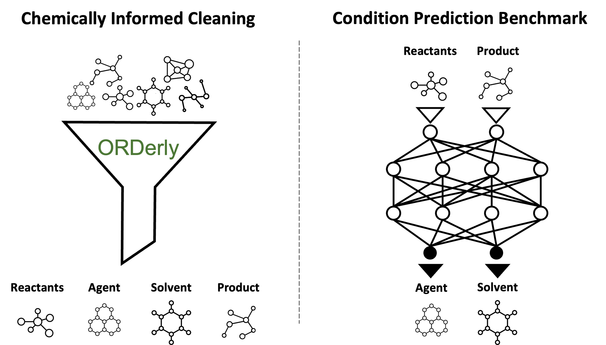

# ORDerly


This is the code for ORDerly: Datasets and benchmarks for chemical reaction data, a preprint has been published on [ChemRxiv](https://chemrxiv.org/engage/chemrxiv/article-details/64ee4a7479853bbd78b21dc7).

🧪 Cleaning chemical reaction data 🧪

🎯 [Chemical Reaction Benchmarks](https://figshare.com/articles/dataset/ORDerly_chemical_reactions_condition_benchmarks/23298467) 🎯

## Quick Install

Requires Python 3.10 (Tested on MacOS and Linux)

```pip install orderly```

🤔 What is this?
-----------------

Machine learning has the potential to provide tremendous value to chemistry. However, large amounts of clean high-quality data are needed to train models

ORDerly cleans chemical reaction data from the growing [Open Reaction Database (ORD)](https://docs.open-reaction-database.org/en/latest/).

Use ORDerly to:
- Extract and clean your own datasets.
- Access the [ORDerly condition prediction benchmark dataset](https://figshare.com/articles/dataset/ORDerly_chemical_reactions_condition_benchmarks/23298467) for reaction condition prediction.
- Reproduce results from our paper including training a ML model to predict reaction conditions.




<!-- Section on extracting and cleaning a dataset-->

📖 Extract and clean a dataset
------------------------------
 
### Download data from ORD

<!-- ```python -m orderly.download.ord```

This will create a folder called ```/data/ord/``` in your current directory, and download the data into ```ord/``` -->

Data in ORD format should be placed in a folder called ```/data/ord/```. You can either use your own data, or the open-source ORD data.

To download the ORD data follow the instructions in the [ORD repository](https://github.com/open-reaction-database/ord-data) (i.e. download [Git LFS](https://git-lfs.com/) and clone their repository. E.g. ```brew install git-lfs``` -> ```git lfs install``` -> ```git lfs pull```). Then place the data within a folder called ```/data/ord/```.

### Extract data from the ORD files

```python -m orderly.extract```

If you want to run ORDerly on your own data, and want to specify the input and output path:

```python -m orderly.extract --input_path="/data/ord/" --output_path="/data/orderly/"```

This will generate a parquet file for each ORD file.

### Clean the data

This will produce train and test parquet files, along with a .json file showing the arguments used and a .log file showing the operations run.

```python -m orderly.clean```

<!-- Section on downloading the benchmark -->
🚀 Download the condition prediction benchmark dataset
--------------------------------------------------------

Reaction condition prediction is the problem of predicting the things "above the arrow" in chemical reactions.

<!-- Include image of a reactions -->

There are three options for donwloading the benchmark.

1) If you have orderly installed you can download the benchmark using this command:

```python -m orderly.download.benchmark```

2) Or you can either download the [ORDerly condition prediction benchmark dataset](https://figshare.com/articles/dataset/ORDerly_chemical_reactions_condition_benchmarks/23298467) directly

3) Or use the following code to download it (without installing ORDerly). Make sure to install needed dependencies first (shown below).


<details>
<summary>Toggle to see code to download benchmark</summary>

```pip install requests fastparquet pandas```

```python
import pathlib
import zipfile

import pandas as pd
import requests


def download_benchmark(
    benchmark_zip_file="orderly_benchmark.zip",
    benchmark_directory="orderly_benchmark/",
    version=2,
):
    figshare_url = (
        f"https://figshare.com/ndownloader/articles/23298467/versions/{version}"
    )
    print(f"Downloading benchmark from {figshare_url} to {benchmark_zip_file}")
    r = requests.get(figshare_url, allow_redirects=True)
    with open(benchmark_zip_file, "wb") as f:
        f.write(r.content)

    print("Unzipping benchmark")
    benchmark_directory = pathlib.Path(benchmark_directory)
    benchmark_directory.mkdir(parents=True, exist_ok=True)
    with zipfile.ZipFile(benchmark_zip_file, "r") as zip_ref:
        zip_ref.extractall(benchmark_directory)


download_benchmark()
train_df = pd.read_parquet("orderly_benchmark/orderly_benchmark_train.parquet")
test_df = pd.read_parquet("orderly_benchmark/orderly_benchmark_test.parquet")
```
</details>


📋 Reproducing results from paper
------------------------------

To reproduce the results from the paper, please clone the repository, and use poetry to install the requirements (see above). Towards the bottom of the makefile, you will find a comprehensive 8 step list of steps to generate all the datasets and reproduce all results presented in the paper. 

### Results

We run the condition prediction model on four different datasets, and find that trusting the labelling of the ORD data leads to overly confident test accuracy. We conclude that applying chemical logic to the reaction string is necessary to get a high-quality dataset, and that the best strategy for dealing with rare molecules is to delete reactions where they appear.

Top-3 exact match combination accuracy (\%): frequency informed guess  // model prediction  //  AIB\%:

| Dataset            | A (labeling; rare->"other")   | B (labeling; rare->delete rxn) | C (reaction string; rare->"other") | D (reaction string; rare->delete rxn) |
|--------------------|--------------------------------|---------------------------------|------------------------------------|--------------------------------------|
| Solvents           | 47 // 58 // 21%                | 50 // 61 // 22%                 | 23 // 42 // 26%                    | 24 // 45 // 28%                      |
| Agents             | 54 // 70 // 35%                | 58 // 72 // 32%                 | 19 // 39 // 25%                    | 21 // 42 // 27%                      |
| Solvents & Agents  | 31 // 44 // 19%                | 33 // 47 // 21%                 | 4 // 21 // 18%                     | 5 // 24 // 21%                       |

Where AIB\% is the Average Improvement of the model over the Baseline (i.e. a frequency informed guess), where $A_m$ is the accuracy of the model, and $A_B$ is the accuracy of the baseline: 
$`AIB = (A_m - A_b) / (1 - A_b)`$


Full API documentation
------------------------

## Extraction
There are two different ways to extract data from ORD files, trusting the labelling, or using the reaction string (as specified in the ```trust_labelling``` boolean). Below you see all the arguments that can be passed to the extraction script, change as appropriate:

```python -m orderly.extract --name_contains_substring="uspto" --trust_labelling=False --output_path="data/orderly/uspto_no_trust" --consider_molecule_names=False```

## Cleaning
There are also a number of customisable steps for the cleaning:

```python -m orderly.clean --output_path="data/orderly/datasets_$(dataset_version)/orderly_no_trust_no_map.parquet" --ord_extraction_path="data/orderly/uspto_no_trust/extracted_ords" --molecules_to_remove_path="data/orderly/uspto_no_trust/all_molecule_names.csv" --min_frequency_of_occurrence=100 --map_rare_molecules_to_other=False --set_unresolved_names_to_none_if_mapped_rxn_str_exists_else_del_rxn=True --remove_rxn_with_unresolved_names=False --set_unresolved_names_to_none=False --num_product=1 --num_reactant=2 --num_solv=2 --num_agent=3 --num_cat=0 --num_reag=0 --consistent_yield=True --scramble=True --train_test_split_fraction=0.9```

A list of solvents (names and SMILES) commonly used in pharmaceutical chemistry can be found at orderly/data/solvents.csv

## Regenerate ORDerly benchmarks

Start by extracting all USPTO data:

```python -m orderly.extract --name_contains_substring="uspto" --trust_labelling=False --output_path="data/orderly/uspto_no_trust" --consider_molecule_names=False```

If you would like to extract all data in ORD (instead of just USPTO data) simply set `name_contains_substring=""`. Now select your desired dataset:

### ORDerly-condition

```python -m orderly.clean --output_path="../orderly_generated_datasets/orderly_condition.parquet" --ord_extraction_path="data/orderly/extracted_ords" --molecules_to_remove_path="data/orderly/all_molecule_names.csv" --min_frequency_of_occurrence=100 --map_rare_molecules_to_other=False --set_unresolved_names_to_none_if_mapped_rxn_str_exists_else_del_rxn=True --remove_rxn_with_unresolved_names=False --set_unresolved_names_to_none=False --num_product=1 --num_reactant=2 --num_solv=2 --num_agent=3 --num_cat=0 --num_reag=0 --consistent_yield=True --scramble=False --train_test_split_fraction=0.9 --remove_reactions_with_no_reactants=True --remove_reactions_with_no_products=True --remove_reactions_with_no_solvents=True --remove_reactions_with_no_agents=True```

### ORDerly-forward

```python -m orderly.clean --output_path="../orderly_generated_datasets/orderly_forward.parquet" --ord_extraction_path="data/orderly/extracted_ords" --molecules_to_remove_path="data/orderly/all_molecule_names.csv" --min_frequency_of_occurrence=0 --map_rare_molecules_to_other=False --set_unresolved_names_to_none_if_mapped_rxn_str_exists_else_del_rxn=True --remove_rxn_with_unresolved_names=False --set_unresolved_names_to_none=False --num_product=2 --num_reactant=3 --num_solv=3 --num_agent=3 --num_cat=0 --num_reag=0 --consistent_yield=False --scramble=False --train_test_split_fraction=0.9 --remove_reactions_with_no_reactants=False --remove_reactions_with_no_products=True --remove_reactions_with_no_solvents=False --remove_reactions_with_no_agents=False```

### ORDerly-retro

```python -m orderly.clean --output_path="../orderly_generated_datasets/orderly_retro.parquet" --ord_extraction_path="data/orderly/extracted_ords" --molecules_to_remove_path="data/orderly/all_molecule_names.csv" --min_frequency_of_occurrence=0 --map_rare_molecules_to_other=False --set_unresolved_names_to_none_if_mapped_rxn_str_exists_else_del_rxn=True --remove_rxn_with_unresolved_names=False --set_unresolved_names_to_none=False --num_product=1 --num_reactant=2 --num_solv=-1 --num_agent=-1 --num_cat=0 --num_reag=0 --consistent_yield=False --scramble=False --train_test_split_fraction=0.9 --remove_reactions_with_no_reactants=True --remove_reactions_with_no_products=True --remove_reactions_with_no_solvents=False --remove_reactions_with_no_agents=False```

## Dataset from all non-USPTO data

First extract all non-USPTO data with the extraction script.

```python -m orderly.extract --name_contains_substring="uspto" --trust_labelling=False --output_path="data/orderly/not_uspto" --consider_molecule_names=False --inverse_substring=True```

Next, simply use the same cleaning script as for USPTO (e.g. ORDerly-retro) for your desired task. The data will then be cleaned in the same way. This is a nice way to create test sets with no leakage. 

## Issues?
Submit an [issue](https://github.com/sustainable-processes/ORDerly/issues) or send an email to dsw46@cam.ac.uk.

## Citing

If you find this project useful, we encourage you to

* Star this repository :star: 
* Cite our [paper](https://chemrxiv.org/engage/chemrxiv/article-details/64ca5d3e4a3f7d0c0d78ca42).
```
@article{Wigh2023,
author = "Daniel Wigh, Joe Arrowsmith, Alexander Pomberger, Kobi Felton, and Alexei Lapkin",
title = "{ORDerly: Datasets and benchmarks for chemical reaction data}",
year = "2023",
month = "8",
url = "https://chemrxiv.org/engage/chemrxiv/article-details/64ca5d3e4a3f7d0c0d78ca42",
journal = "ChemRxiv"
} 
```


<!-- ### 2. Run extraction

We can run extraction using: ```poetry run python -m orderly.extract```. Using ```poetry run python -m orderly.extract --help``` will explain the arguments. Certain args must be set such as data paths.

### 3. Run cleaning

We can run cleaning using: ```poetry run python -m orderly.clean```. Using ```poetry run python -m orderly.clean --help``` will explain the arguments. Certain args must be set such as data paths. -->

